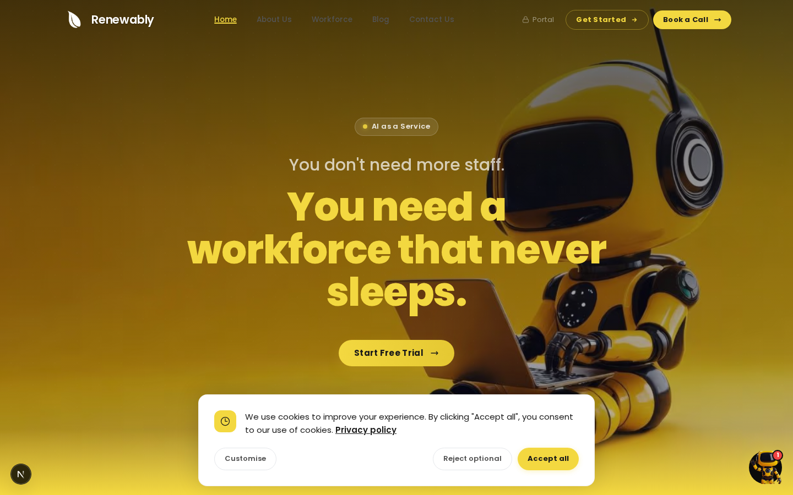
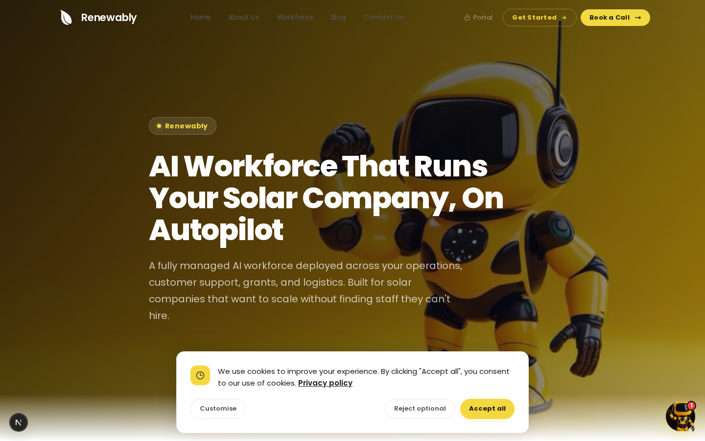
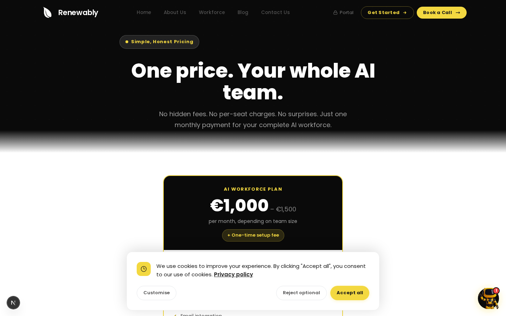
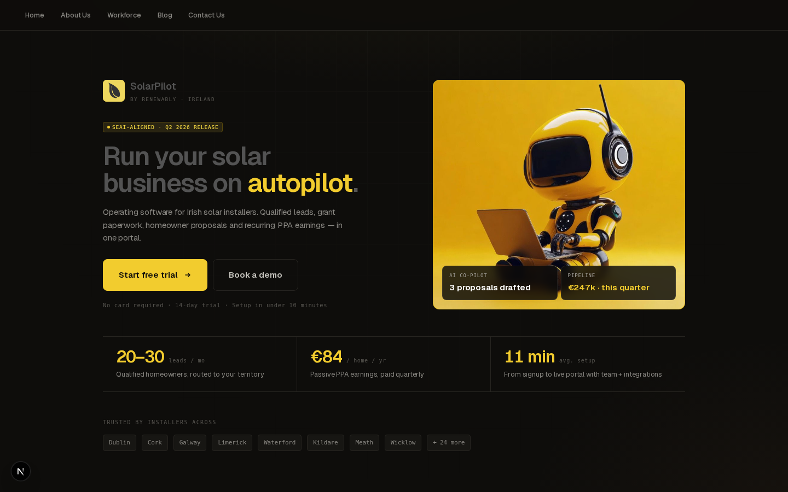
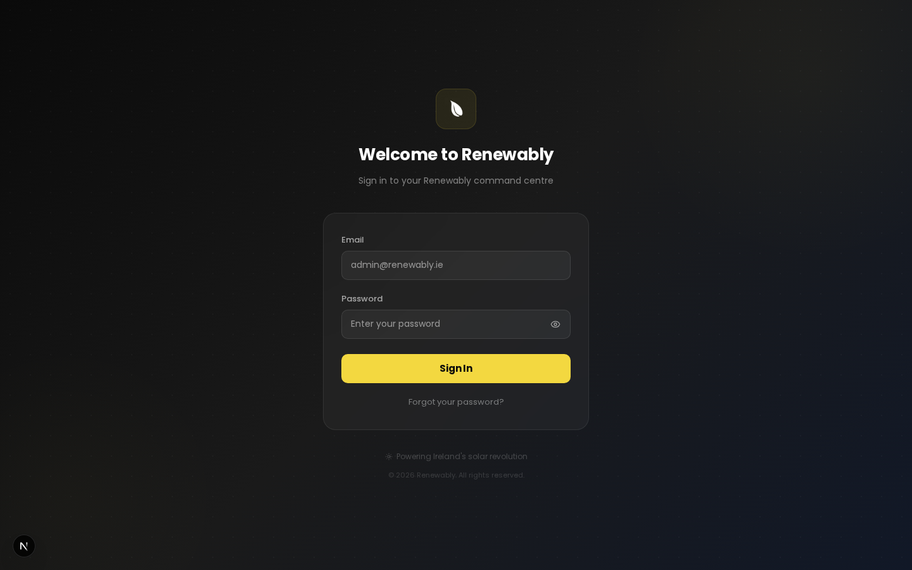

<div align="center">


# Renewably

**Internal operations platform for the Renewably team**

[](https://nextjs.org)
[](https://typescriptlang.org)
[](https://tailwindcss.com)
[](https://supabase.com)
[](https://prisma.io)
[](https://anthropic.com)
[](https://stripe.com)
[]()

[renewably.ie](https://renewably.ie) &middot; [Quick Start](#quick-start) &middot; [Architecture](#architecture) &middot; [API Reference](#api-reference) &middot; [Deployment](#deployment)

</div>

---

## What is this?

**Renewably** is a dual-purpose platform:

- **Marketing website** (`/`) — Conversion-optimised site for prospective solar installers. Features an AI chatbot that captures leads, a 10-step onboarding wizard, and a blog. This is what visitors see at [renewably.ie](https://renewably.ie).
- **CRM dashboard** (`/crm`) — Internal tool for the Renewably team. Manages the full sales pipeline: contacts, deals (9-stage Kanban board), proposals, invoices, billing (Stripe), calendar (Google), tasks, workflows, and an AI assistant powered by Claude.

The CRM tracks sales of **SolarPilot** (a customer-facing CRM for solar installers, built in a separate repo) and the **AI Workforce** upsell. Leads from the website chatbot and onboarding wizard flow directly into the CRM as contacts and deals.

> **Renewably ≠ SolarPilot.** This repo powers the Renewably team's internal operations. SolarPilot is what customers buy — it lives in [its own repository](#).

---

## Quick Start

```bash
# 1. Clone and install
git clone https://github.com/RenewableIreland/Renewably.git && cd Renewably
bun install

# 2. Configure environment
cp .env.example .env
# Fill in the 11 required variables (see Environment Variables below)

# 3. Database setup
npx prisma migrate deploy && npx prisma generate
npx prisma db seed

# 4. Start developing
bun dev                    # → http://localhost:3000
```

That's it. The marketing site is live at `/`, the CRM login at `/crm/login`.

---

## Screenshots

<table>
<tr>
<td width="50%"></td>
<td width="50%"></td>
</tr>
<tr>
<td width="50%"></td>
<td width="50%"></td>
</tr>
<tr>
<td width="50%"></td>
<td width="50%"><em>CRM dashboard screenshots require authentication</em></td>
</tr>
</table>

---

## Architecture

```
                    ┌─────────────────────────────────────┐
                    │         renewably.ie (Caddy)         │
                    │        Reverse proxy / HTTPS         │
                    └─────────────────┬───────────────────┘
                                      │
                    ┌─────────────────┴───────────────────┐
                    │       Next.js 16 (standalone)        │
                    │                                      │
                    │   ┌──────────────────────────────┐   │
                    │   │  proxy.ts — auth middleware   │   │
                    │   │  JWT validation via Supabase │   │
                    │   │  Rate limit: 10 req/min/IP   │   │
                    │   └──────────────┬───────────────┘   │
                    │                  │                    │
                    │   ┌──────────────┴───────────────┐   │
                    │   │                               │   │
                    │   │  Public routes (/)            │   │
                    │   │  ─ Marketing site             │   │
                    │   │  ─ Blog (8 articles)          │   │
                    │   │  ─ AI chat widget (lead cap)  │   │
                    │   │  ─ Onboarding wizard (10 st)  │   │
                    │   │  ─ Contact form               │   │
                    │   │                               │   │
                    │   │  /crm (authenticated)         │   │
                    │   │  ─ Dashboard + KPIs           │   │
                    │   │  ─ Pipeline (Kanban, 9 stg)   │   │
                    │   │  ─ Companies + Contacts       │   │
                    │   │  ─ Deals + Proposals          │   │
                    │   │  ─ Invoices + Billing         │   │
                    │   │  ─ AI Assistant (Claude)      │   │
                    │   │  ─ Calendar + Meetings        │   │
                    │   │  ─ Tasks + Workflows          │   │
                    │   │  ─ Reports + Analytics        │   │
                    │   └──────────────────────────────┘   │
                    └──────────────────┬───────────────────┘
                                       │
           ┌───────────────────────────┼───────────────────────────┐
           │                           │                           │
  ┌────────┴──────────┐    ┌──────────┴──────────┐    ┌───────────┴──────────┐
  │ Supabase (Postgres)│    │  SQLite (Prisma)    │    │   External APIs     │
  │                    │    │  25 models          │    │                     │
  │  auth.users        │    │  Companies          │    │  Anthropic Claude   │
  │  profiles          │    │  Contacts + Tags    │    │  Stripe             │
  │  email_logs        │    │  Deals (9 stages)   │    │  Postmark           │
  │                    │    │  Proposals           │    │  Google Calendar    │
  │                    │    │  Invoices + Payments │    │  Z-AI SDK           │
  │                    │    │  Tasks + Notes       │    │  WhatsApp (Twilio)  │
  │                    │    │  Workflows           │    │                     │
  │                    │    │  Installer profiles  │    │                     │
  └────────────────────┘    └─────────────────────┘    └─────────────────────┘
```

### Dual-database design

The platform uses two databases intentionally:

| | **Supabase (PostgreSQL)** | **SQLite (Prisma)** |
|---|---|---|
| **Purpose** | Authentication + email logs | All CRM business data |
| **Key tables** | `auth.users`, `profiles`, `email_logs` | Companies, Contacts, Deals, Invoices, Proposals, Tasks, Notes, Workflows, Subscriptions, InstallerProfiles, and 15 more |
| **Accessed via** | `@supabase/supabase-js` | Prisma ORM |
| **Why** | Battle-tested JWT management, password recovery, email confirmation | Entire dataset stays local and portable — no external database dependency for core business logic |

### How a request flows

**Visitor hits `/`** — `proxy.ts` passes through (public route). Next.js renders the homepage.

**Visitor chats on the widget** — `POST /api/chat-widget` sends the message to the Z-AI SDK. The AI monitors for buying signals (solar installation intent, budget, timeline). When detected, it creates a Contact and Deal in SQLite and emails `hello@renewably.ie`.

**Visitor starts onboarding** — The 10-step wizard at `/onboarding` collects company details. Progress is saved to `OnboardingSubmission` in SQLite so visitors can resume later.

**Team member logs in** — `POST /api/crm/auth/login` validates against Supabase Auth, fetches the profile, sets HttpOnly JWT cookies.

**Team member opens dashboard** — `proxy.ts` reads the JWT cookie, validates via `supabase.auth.getUser()`, renders the dashboard or redirects to login.

**Team member drags a deal** — `PUT /api/crm/pipeline` updates the stage in SQLite, triggers a Postmark email, logs the activity.

**Team member creates an invoice** — `POST /api/crm/invoices` stores it. `GET /api/crm/invoices/[id]/pdf` generates a PDF. `POST .../send` emails it via Postmark. `POST .../payment-link` creates a Stripe link.

**Team member asks AI assistant** — `POST /api/crm/ai` fetches CRM context from SQLite, injects it into a Claude prompt, streams the response. Supports 8 action types: email drafting, call scripts, deal insights, objection handling, and more.

---

## Tech Stack

| Layer | Technology | Notes |
|-------|-----------|-------|
| Framework | Next.js 16 | App Router, standalone output |
| Language | TypeScript 5 | Strict mode |
| Runtime | Bun | Node.js fallback for production |
| Styling | Tailwind CSS 4 + shadcn/ui | 49 UI primitives |
| Animations | Framer Motion 12 | Scroll reveals, page transitions |
| Auth DB | Supabase (PostgreSQL) | JWT + HttpOnly cookies (7-day expiry) |
| Business DB | SQLite via Prisma ORM | 25 models |
| Auth | Supabase Auth | JWT + HttpOnly cookies |
| Email | Postmark | Transactional + delivery webhooks |
| Payments | Stripe | Checkout, customer portal, webhooks |
| Calendar | Google Calendar API | OAuth2, bidirectional sync |
| AI (internal) | Anthropic Claude | 8 action types, streaming |
| AI (public) | Z-AI SDK | Website chat widget, lead capture |
| Messaging | WhatsApp (Twilio) | Business messaging + webhooks |
| Charts | Recharts | Revenue, pipeline, KPIs |
| State | TanStack Query 5 | Server state management |
| Tables | `@tanstack/react-table` | Sortable, filterable |
| Forms | React Hook Form 7 + Zod 4 | Type-safe validation |
| Drag & Drop | dnd-kit | Pipeline Kanban board |
| PDF | `@react-pdf/renderer` | Invoice + proposal generation |
| Caching | Redis | Optional — degrades to in-memory |
| Testing | Vitest 4 + Testing Library | 6 suites, 261 passed, 2 skipped |
| Reverse Proxy | Caddy | Automatic HTTPS (Let's Encrypt) |

---

## Database Schema

25 Prisma models across 4 domains:

### Sales Pipeline
`Company` → `Contact` → `Deal` → `DealActivity` → `Proposal` → `ProposalLineItem` → `Invoice` → `InvoiceLineItem` → `Payment`

### Tagging
`Tag` → `ContactTag`, `DealTag`

### Operations
`Task`, `Note`, `WorkflowRule` → `WorkflowExecution`

### Platform
`User`, `Session`, `Subscription`, `InstallerProfile`, `InstallerDocument`, `Onboarding`, `OnboardingSubmission`, `PipelineStage`, `GoogleCalendarConnection`

---

## Pages

### Marketing (Public)

| Page | Route | Description |
|------|-------|-------------|
| Home | `/` | Hero, AI agent showcase, FAQ, pricing, CTAs |
| Services | `/services` | Solar-specific service offerings |
| AI Workforce | `/workforce` | AI agent role descriptions |
| Pricing | `/pricing` | Starter / Pro / Enterprise plans |
| About | `/about` | Company story |
| Blog | `/blog` | 8 articles (markdown) |
| Contact | `/contact` | Contact form → Postmark |
| Onboarding | `/onboarding` | 10-step signup wizard (no auth) |
| Privacy | `/privacy` | Privacy policy |
| Terms | `/terms` | Terms of service |

### CRM (Authenticated)

| Page | Route | Description |
|------|-------|-------------|
| Dashboard | `/crm/dashboard` | KPIs, revenue charts, pipeline funnel, activity feed |
| Pipeline | `/crm/pipeline` | Drag-and-drop Kanban (dnd-kit, 9 stages) |
| Companies | `/crm/companies` | Installer profiles — search, filter, sort |
| Contacts | `/crm/contacts` | Decision-maker directory |
| Deals | `/crm/deals` | Deal list with filtering |
| Proposals | `/crm/proposals` | Create, send, duplicate, PDF, templates |
| Invoices | `/crm/invoices` | CRUD, PDF, Stripe links, credit notes |
| Activities | `/crm/activities` | Unified timeline across deals, contacts, companies |
| Calendar | `/crm/calendar` | Google Calendar integration (OAuth2) |
| Meetings | `/crm/meetings` | Scheduling with calendar push |
| Tasks | `/crm/tasks` | Priorities, due dates, reordering |
| Installers | `/crm/installers` | Health scores, performance, CSV export |
| Reports | `/crm/reports` | Revenue + pipeline analytics, data export |
| Billing | `/crm/billing` | Stripe subscription management |
| Workflows | `/crm/workflows` | Automation triggers, executions, status |
| Settings | `/crm/settings` | Profile, branding, logo, password |

### Onboarding Wizard

A 10-step public signup wizard that captures company profiles from prospective solar installers. Submissions flow into the CRM.

| Step | What it collects |
|------|-----------------|
| 1 | Introduction (no data) |
| 2 | Company name + contact info |
| 3 | Business type, SEAI reg, team size |
| 4 | Service area + target counties |
| 5 | Revenue range + pricing model |
| 6 | Current software and tools |
| 7 | Hardware and equipment |
| 8 | Compliance and certifications |
| 9 | Account creation |
| 10 | Confirmation |

---

## API Reference

101 API route handlers across public and authenticated endpoints.

### Public Endpoints

| Endpoint | Methods | Description |
|----------|---------|-------------|
| `/api/contact` | POST | Contact form → Postmark email |
| `/api/chat-widget` | POST | AI chat with lead capture (buying signal detection) |
| `/api/ai-agent` | GET, POST, PUT, DELETE | Content management (auth: `AGENT_API_KEY` header) |
| `/api/onboarding/progress` | GET, PUT | Wizard progress save/resume |
| `/api/onboarding/submit` | POST | Completed form submission |

### CRM Auth

| Endpoint | Methods | Description |
|----------|---------|-------------|
| `/api/crm/auth/login` | POST | Email/password → HttpOnly JWT cookies |
| `/api/crm/auth/logout` | POST | Clear session + cookies |
| `/api/crm/auth/me` | GET | Current user profile |
| `/api/crm/auth/refresh` | POST | Refresh JWT tokens |

### CRM Core (all require JWT)

| Domain | Endpoints | Key operations |
|--------|-----------|---------------|
| **Dashboard** | `GET /api/crm/dashboard` | KPIs, pipeline funnel, revenue, activity feed |
| **Companies** | `GET, POST /api/crm/companies` + `GET, PUT, DELETE /[id]` | CRUD + logo upload |
| **Contacts** | `GET, POST /api/crm/contacts` + `GET, PUT, DELETE /[id]` | CRUD + inline editing |
| **Deals** | `GET, POST /api/crm/deals` + `GET, PATCH, DELETE /[id]` | CRUD + activities |
| **Pipeline** | `GET, PUT /api/crm/pipeline` | Board data + drag-and-drop reorder |
| **Proposals** | 10 endpoints | CRUD, PDF, send, duplicate, templates |
| **Invoices** | 14 endpoints | CRUD, PDF, Stripe links, credit notes |
| **Tasks** | `GET, POST, PUT` + `PUT, DELETE /[id]` | CRUD + reorder |
| **Meetings** | `GET, POST` + `GET, PATCH, DELETE /[id]` | CRUD + complete/cancel + calendar push |
| **Calendar** | 8 endpoints | Google OAuth2, events, sync, push, disconnect |
| **Activities** | `GET, POST` + notes + tags | Unified activity feed |
| **WhatsApp** | 5 endpoints | Messages, send, webhook, config |
| **AI Assistant** | `POST /api/crm/ai` + status + usage | Claude with CRM context, 8 action types |
| **Billing** | 5 endpoints | Stripe plans, checkout, portal, webhook |
| **Email** | 2 endpoints | Postmark sending + delivery webhook |
| **Workflows** | 5 endpoints | CRUD + trigger + executions |
| **Reports** | 3 endpoints | CRUD + data export |
| **Installers** | 5 endpoints | CRUD + performance + bulk + CSV |
| **Settings** | 4 endpoints | Profile, logo, password, overview stats |

---

## Authentication

JWT-based via Supabase Auth. Flow:

1. `POST /api/crm/auth/login` — validates email/password against Supabase
2. Returns HttpOnly, SameSite=Lax, Secure cookies: `sb-access-token` + `sb-refresh-token`
3. Every CRM request passes through `proxy.ts` → `requireAuth()` → `supabase.auth.getUser()`
4. Tokens refresh automatically via `POST /api/crm/auth/refresh`
5. Cookie expiry: 7 days

> **Important:** `proxy.ts` is the auth middleware. Do NOT create `src/middleware.ts` — it conflicts with the proxy.

---

## Security

| Layer | Implementation |
|-------|---------------|
| **Authentication** | JWT via Supabase Auth, HttpOnly cookies, 7-day expiry |
| **CSRF** | Origin/Referer validation on all mutation endpoints. `requireAuth()` validates origin. Public routes use `validateCsrfOrigin()` from `crm-route-helpers.ts` |
| **SQL Injection** | Prevented — Supabase and Prisma both use parameterized queries |
| **XSS** | Input sanitization via `sanitize.ts`, CSP headers in `next.config.ts` |
| **Rate Limiting** | 10 req/min/IP in `proxy.ts`, backed by Redis (degrades to in-memory) |
| **Webhook Verification** | Cryptographic signature verification for Postmark delivery and Stripe billing webhooks |
| **Content Security Policy** | Configured in `next.config.ts` with strict directives |
| **Cookie Security** | HttpOnly, SameSite=Lax, Secure (production) on all auth cookies |

---

## Environment Variables

11 variables total. 5 are required, 6 are optional.

| Variable | Required | Default | Purpose |
|----------|----------|---------|---------|
| `NEXT_PUBLIC_SUPABASE_URL` | Yes | — | Supabase project URL |
| `NEXT_PUBLIC_SUPABASE_ANON_KEY` | Yes | — | Supabase anonymous key |
| `SUPABASE_SERVICE_ROLE_KEY` | Yes | — | Supabase service role (admin access) |
| `STRIPE_SECRET_KEY` | Yes | — | Stripe secret key (billing + invoices) |
| `STRIPE_WEBHOOK_SECRET` | Yes | — | Stripe webhook signature verification |
| `POSTMARK_SERVER_TOKEN` | No | — | Postmark API token (enables email) |
| `POSTMARK_FROM_EMAIL` | No | `hello@renewably.ie` | Sender email address |
| `ANTHROPIC_API_KEY` | No | — | Anthropic API key (enables Claude AI) |
| `REDIS_URL` | No | — | Redis connection URL (enables rate limit persistence) |
| `NEXT_PUBLIC_BASE_URL` | No | — | Public base URL (OAuth redirects, password reset) |
| `NEXT_PUBLIC_STRIPE_PUBLISHABLE_KEY` | No | — | Stripe publishable key (client-side Stripe) |

---

## Project Structure

```
renewably/
├── .env.example                     # 11 environment variables
├── .env.production                  # Production template (with Supabase URL)
├── .github/workflows/ci-cd.yml     # GitHub Actions — lint, test, build, deploy
├── Dockerfile                       # Multi-stage build (Node 20 Alpine)
├── docker-compose.production.yml    # Production services (app + redis + caddy)
├── Caddyfile.production             # HTTPS reverse proxy config
├── Caddyfile                        # Dev reverse proxy (port 81 → 3000)
├── next.config.ts                   # CSP, security headers, standalone output
├── keep-alive.sh                    # Dev server keep-alive (cron)
├── vitest.config.ts                 # Test configuration
│
├── prisma/
│   ├── schema.prisma                # 25 models (SQLite)
│   └── seed.ts                      # Sample data seeder
│
├── public/
│   ├── screenshots/                 # README screenshots (5)
│   ├── agents/                      # AI workforce photos (8)
│   ├── onboarding/                  # Wizard-specific images
│   ├── logo-*.png                   # Brand logos (6 variants)
│   ├── robot-*.jpg                  # Robot branding (5 variants)
│   ├── hero-*.png                   # Homepage hero visuals
│   └── *.png / *.jpg / *.webm       # Other static assets
│
└── src/
    ├── proxy.ts                     # Auth middleware (replaces middleware.ts)
    │
    ├── app/                         # Next.js App Router
    │   ├── layout.tsx               # Root layout — OG, JSON-LD, Sonner
    │   ├── globals.css              # Tailwind + CSS variable theme
    │   ├── page.tsx                 # Homepage
    │   ├── {about,blog,contact,pricing,services,privacy,terms,workforce}/
    │   ├── onboarding/              # 10-step signup wizard (public)
    │   └── crm/                     # CRM dashboard (authenticated)
    │       ├── layout.tsx           # Sidebar, nav, auth provider
    │       ├── login/page.tsx       # Email + password login
    │       ├── dashboard/page.tsx   # KPIs, charts, activity feed
    │       ├── pipeline/page.tsx    # Drag-and-drop Kanban (9 stages)
    │       ├── {companies,contacts,deals,activities,calendar,
    │       │    meetings,tasks,proposals,invoices,installers,
    │       │    reports,billing,settings,workflows}/page.tsx
    │       └── ...
    │
    ├── api/                         # 101 route handlers
    │   ├── contact/route.ts         # Public contact form
    │   ├── chat-widget/route.ts     # AI chat + lead capture
    │   ├── onboarding/              # Wizard progress + submit
    │   └── crm/                     # 95 authenticated endpoints
    │       ├── auth/                # Login, logout, me, refresh
    │       ├── dashboard/           # KPIs + analytics
    │       ├── {companies,contacts,leads,deals}/
    │       ├── pipeline/            # Board + reorder
    │       ├── {proposals,invoices}/ # Full CRUD + PDF + Stripe
    │       ├── calendar/google/     # 8 OAuth2 endpoints
    │       ├── whatsapp/            # 5 messaging endpoints
    │       ├── ai/                  # Claude assistant
    │       ├── billing/             # Stripe integration
    │       ├── workflows/           # Automation engine
    │       └── ...
    │
    ├── components/                  # ~130 React components
    │   ├── SiteShell.tsx            # Public layout (Header + Footer + Chat)
    │   ├── crm/                     # 32 CRM components
    │   ├── onboarding/              # 17 wizard components
    │   └── ui/                      # 49 shadcn/ui primitives
    │
    ├── lib/                         # Server utilities (24 files)
    │   ├── supabase.ts              # Supabase client + service role
    │   ├── crm-auth.ts              # requireAuth(), requireAdmin()
    │   ├── db.ts                    # Prisma client singleton
    │   ├── claude.ts                # Claude — 8 actions + streaming
    │   ├── stripe.ts                # Stripe checkout, portal, webhooks
    │   ├── postmark.ts              # 4 email templates + logging
    │   ├── redis.ts                 # Redis client (lazy, optional)
    │   ├── rate-limit.ts            # Per-IP rate limiter
    │   └── ...
    │
    ├── data/                        # Static JSON (AI agent CRUD target)
    │   ├── blog.json, services.json, testimonials.json, faqs.json
    │
    └── __tests__/                   # 6 test suites (~2,274 lines)
```

---

## Deployment

### Option 1: Docker (Recommended)

```bash
git clone https://github.com/RenewableIreland/Renewably.git && cd Renewably
cp .env.production .env   # Edit with your secrets
docker compose -f docker-compose.production.yml up -d --build
docker compose -f docker-compose.production.yml exec app npx prisma migrate deploy
```

Three services orchestrated by Docker Compose:

| Service | Port | Purpose |
|---------|------|---------|
| `app` | 3000 (internal) | Next.js standalone (Node 20 Alpine) |
| `redis` | 6379 (internal) | Rate limiting + optional caching |
| `caddy` | 80, 443 | Reverse proxy with automatic HTTPS |

### Option 2: Manual

```bash
bun install
npx prisma migrate deploy && npx prisma generate
bun run build    # → .next/standalone/
NODE_ENV=production bun .next/standalone/server.js
```

Put Caddy (or nginx) in front for HTTPS. All services use `restart: unless-stopped` in Docker; for manual deploys, use `systemd` or `pm2`.

### CI/CD

The `.github/workflows/ci-cd.yml` pipeline runs on every push to `main`:

1. **Lint** — ESLint
2. **Test** — Vitest (all 263 tests must pass)
3. **Type check** — TypeScript strict mode
4. **Build** — `next build` (zero errors)
5. **Deploy** — SSH → pull → rebuild Docker containers

---

## Contributing

1. Branch off `main`: `git checkout -b feat/your-feature`
2. Make changes, write tests for new logic
3. Run checks: `bun run lint && bun run test && bun run build`
4. Commit with conventional commits: `feat:`, `fix:`, `docs:`, `chore:`
5. Push and open a PR against `main`

### Key rules

- Never create `src/middleware.ts` — use `src/proxy.ts` instead
- Use Zod v4 syntax: `z.record(z.string(), z.unknown())` (both params required)
- `deal_activities` table has no `updated_at` column
- Use webpack for builds (Turbopack has ENOENT bugs in this project)
- CSS animations only for the CRM — no framer-motion in `/crm` components
- Theme: dark `#080808`, gold `#F3D840`, Poppins font

---

## Troubleshooting

| Issue | Fix |
|-------|-----|
| `prisma/schema.prisma` not found | It's auto-generated. Models are in `node_modules/.prisma/client/schema.prisma`. Use Prisma commands normally. |
| Build fails with ENOENT | Turbopack bug. Use webpack: remove `--turbopack` from dev command, or build with `next build` (defaults to webpack). |
| JWT cookies not set | Check `NEXT_PUBLIC_SUPABASE_URL` matches your Supabase project. Cookies won't set on mismatched domains. |
| Rate limit errors | Redis not connected? It degrades to in-memory, which resets on restart. Set `REDIS_URL` for persistence. |
| Google Calendar auth fails | OAuth redirect URI must match `NEXT_PUBLIC_BASE_URL + /api/crm/calendar/google/callback` in Google Console. |
| Stripe webhooks return 400 | Set `STRIPE_WEBHOOK_SECRET` from the Stripe dashboard (not the API key). |
| Tests fail with module errors | Run `npx prisma generate` first — tests import from the generated client. |

---

## Stats

| Metric | Value |
|--------|-------|
| API endpoints | 101 |
| React components | ~130 |
| Prisma models | 25 |
| shadcn/ui primitives | 49 |
| CRM pages | 16 |
| Marketing pages | 10 |
| Blog posts | 8 |
| Email templates | 4 |
| AI assistant actions | 8 |
| Pipeline stages | 9 (`new_lead` → `contacted` → `discovery_call` → `demo_booked` → `demo_done` → `proposal_sent` → `negotiation` → `closed_won` / `closed_lost`) |
| Test suites | 6 (2,274 lines) |
| Tests | 263 (261 passed, 2 skipped) |
| Environment variables | 11 |

---

## License

Private — all rights reserved. Not licensed for external use.
